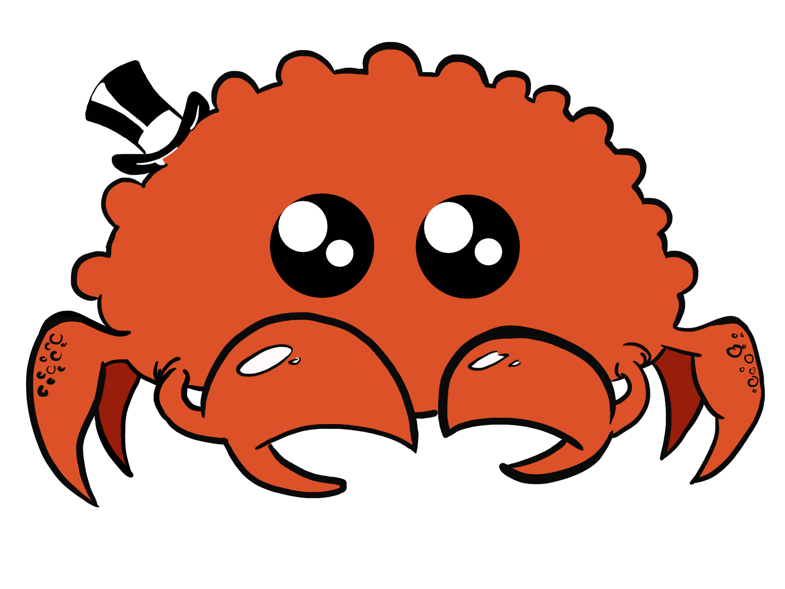

# [rustaceanize.me](https://sspaink.github.io/rustaceanize.me/)

:crab: Try it out: <https://sspaink.github.io/rustaceanize.me/> :crab:

Make your own custom [Rust mascot](https://rustacean.net/)!

This project was created using the template repo for [eframe](https://github.com/emilk/egui/tree/master/crates/eframe), a framework for writing apps using [egui](https://github.com/emilk/egui/).

## Web Locally

You can compile your app to [WASM](https://en.wikipedia.org/wiki/WebAssembly) and publish it as a web page.

We use [Trunk](https://trunkrs.dev/) to build for web target.

1. Install the required target with `rustup target add wasm32-unknown-unknown`.
2. Install Trunk with `cargo install --locked trunk`.
3. Run `trunk serve` to build and serve on `http://127.0.0.1:8080`. Trunk will rebuild automatically if you edit the project.
4. Open `http://127.0.0.1:8080/index.html#dev` in a browser. See the warning below.

> `assets/sw.js` script will try to cache our app, and loads the cached version when it cannot connect to server allowing your app to work offline (like PWA).
> appending `#dev` to `index.html` will skip this caching, allowing us to load the latest builds during development.
